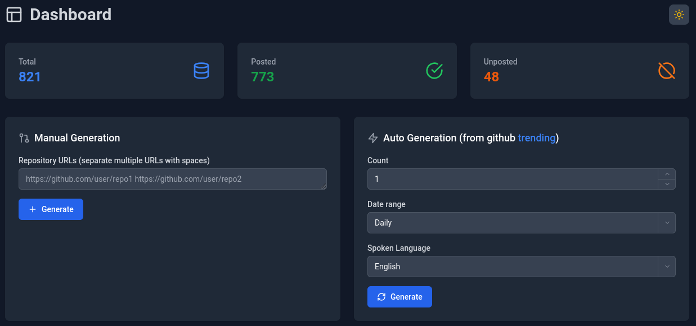

<h1 align="center">Content Sentinel</h1>

<div align="center">

[](https://reactjs.org/)
[](https://www.typescriptlang.org/)
[](https://vitejs.dev/)
[](https://tailwindcss.com/)
[](https://opensource.org/licenses/MIT)


</div>

## Description

This application allows you to monitor, generate, and manage GitHub repositories from [content-alchemist](https://github.com/think-root/content-alchemist) app.

## Features

- **Repository Management**: View, search, and filter GitHub repositories
- **Manual Generation**: Add repositories manually by URL
- **Auto Generation**: Automatically fetch trending GitHub repositories
- **Status Tracking**: Monitor which repositories have been posted to social media
- **Cron Jobs**: Schedule automatic repository generation and posting
- **Dark/Light Mode**: Toggle between dark and light themes

## Technology Stack

- **Frontend**: React 18 with TypeScript
- **Styling**: Tailwind CSS
- **Build Tool**: Vite
- **Icons**: Lucide React

## Screenshots



## Getting Started

### Prerequisites

- Node.js (v16 or higher)
- npm or yarn

### Installation

1. Clone the repository
   ```bash
   git clone https://github.com/think-root/dashboard.git
   cd dashboard
   ```

2. Install dependencies
   ```bash
   npm install
   # or
   yarn
   ```

3. Create an environment file
   ```bash
   cp .env.example .env
   ```

4. Update the `.env` file with your data
   - `API_BASE_URL` - URL of the content-alchemist API
   - `API_BEARER_TOKEN` - Authentication token for API access
   - `PORT` - Port for the application to run on (default: 3000)
   - `DATE_FORMAT` - Format for displaying dates (e.g., DD.MM.YYYY HH:mm:ss)
   - `TIMEZONE` - Timezone for date display (e.g., Europe/Kiev)

### Development

Start the development server:

```bash
npm run dev
# or
yarn dev
```

The application will be available at http://localhost:5173

### Building for Production

Create a production build:

```bash
npm run build
# or
yarn build
```

Preview the production build:

```bash
npm run preview
# or
yarn preview
```

### Running with Docker

#### Prerequisites

- Docker
- Docker Compose

#### Using Docker Compose

1. Make sure you have a `.env` file with the necessary environment variables:
   ```
   API_BASE_URL=your_api_url
   API_BEARER_TOKEN=your_token
   PORT=3000
   DATE_FORMAT=DD.MM.YYYY HH:mm:ss
   TIMEZONE=Europe/Kiev
   ```

2. Build and start the container:
   ```bash
   docker-compose up -d
   ```

   This will build the image and start the container named `content-sentinel` on the port specified in your `.env` file (defaults to 3000).

3. Access the application at http://localhost:3000

#### Using Docker Directly

1. Build the Docker image:
   ```bash
   docker build -t content-sentinel:latest .
   ```

2. Run the container:
   ```bash
   docker run -d \
     --name content-sentinel \
     -p 3000:3000 \
     -e API_BASE_URL=your_api_url \
     -e API_BEARER_TOKEN=your_token \
     -e PORT=3000 \
     -e DATE_FORMAT=preferred_format \
     -e TIMEZONE=preferred_timezone \
     content-sentinel:latest
   ```

3. Access the application at http://localhost:3000

#### Stopping the Container

Using Docker Compose:
```bash
docker-compose down
```

Using Docker directly:
```bash
docker stop content-sentinel
docker rm content-sentinel
```

## API Integration

The dashboard connects to a [content-alchemist](https://github.com/think-root/content-alchemist) API with the following endpoints:

- `/api/get-repository/` - Fetch repositories with filtering options
- `/api/manual-generate/` - Manually add repositories by URL
- `/api/auto-generate/` - Automatically generate repositories from GitHub trending

All API requests include a Bearer token for authentication.

## Project Structure

- `src/` - Application source code
  - `components/` - React components
  - `api.ts` - API integration functions
  - `types.ts` - TypeScript type definitions
  - `App.tsx` - Main application component
- `public/` - Static assets
- `dist/` - Production build output

## License

This project is licensed under the terms found in the LICENSE file in the repository root.

