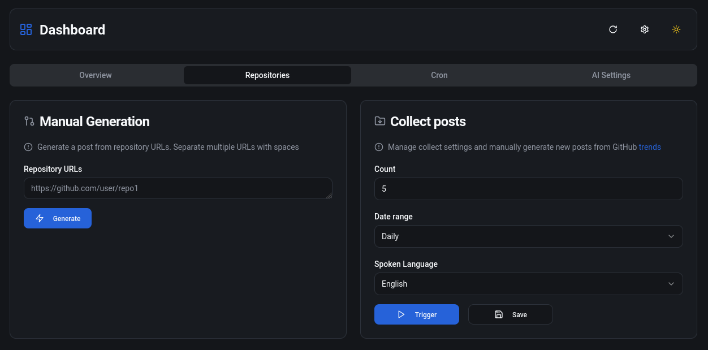
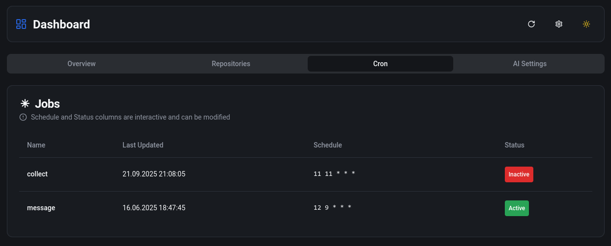
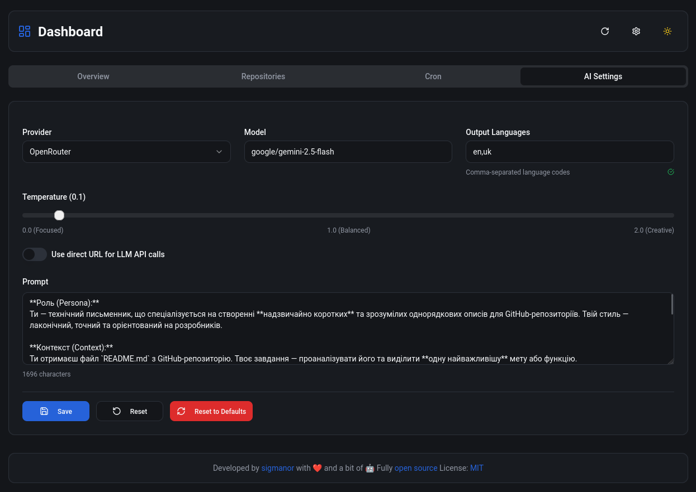

<h1 align="center">Content Sentinel</h1>

<div align="center">


[](https://reactjs.org/)
[](https://vitejs.dev/)
[](https://github.com/think-root/content-sentinel/releases)
[](https://github.com/think-root/content-sentinel/blob/main/CHANGELOG.md)


</div>

## Description

In fact, this is a dashboard that allows you to monitor and manage the data of the [content-alchemist](https://github.com/think-root/content-alchemist) database and cron tasks of [content-maestro](https://github.com/think-root/content-maestro) using their APIs. Therefore, for this app to work correctly, you need to run both [content-alchemist](https://github.com/think-root/content-alchemist) and [content-maestro](https://github.com/think-root/content-maestro) first.

## Features

- **Posts Management**: View, search, and filter posts
- **Manual Generation**: Manually generate posts by repository URL
- **Auto Generation**: Automatically generate posts from trending GitHub repositories
- **Status Tracking**: Monitor which repositories have been or will be posted to social media next
- **Dark/Light Mode**: Toggle the interface between dark and light themes

## Technology Stack

- **Frontend**: React 18 with TypeScript
- **Styling**: Tailwind CSS
- **Build Tool**: Vite
- **Icons**: Lucide React

## Screenshots








## Getting Started

### Prerequisites

- Node.js (v16 or higher)
- npm

### Installation

1. Clone the repository
   ```bash
   git clone https://github.com/think-root/content-sentinel.git
   cd content-sentinel
   ```

2. Install dependencies
   ```bash
   npm ci --production
   ```

3. Create an environment file
   ```bash
   cp .env.example .env
   ```

4. Update the `.env` file with your data
   ```bash
   PORT=3000
   ```

5. Build project
    ```bash
    npm run build
    ```

6. Start the preview server at http://localhost:4173/dashboard/
    ```bash
    npm run preview
    ```

7. Run production server at http://localhost:3000/dashboard/
    ```bash
    npm start
    ```

### Docker

Run via docker compose:
   ```bash
   docker compose up -d
   ```

Or run the container directly:
   ```bash
   docker run -d \
     --name content-sentinel \
     -p 3000:3000 \
     -e PORT=3000 \
     content-sentinel:latest
   ```

Access the application at http://localhost:3000/dashboard/

### Configuration Settings

For successful use, you must fill in some settings that can be found in the site header on the right, the “Settings” button

| Setting | Description | Required |
|---------|-------------|----------|
| API Base URL | Enter the URL of your content-alchemist API | Yes |
| API Bearer Token | Provide your authentication token for API access | Yes |
| Date Format | Choose your preferred date format (default: DD.MM.YYYY HH:mm) | No |
| Timezone | Select your timezone (default: Europe/Kyiv) | No |

All settings are automatically saved and persisted in your browser's local storage.

## Development

1. Install the development dependencies and start the development server:
    ```bash
    npm install
    npm run dev
    ```

2. Access the application at http://localhost:5173/dashboard/


## License

This project is licensed under the terms found in the [LICENSE](LICENSE) file in the repository root.