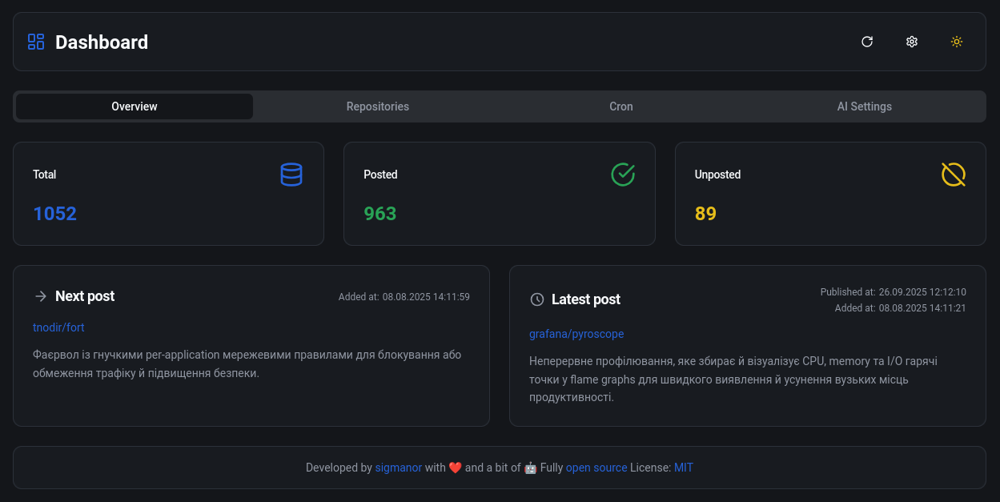

<h1 align="center">Content Sentinel</h1>

<div align="center">

[](https://reactjs.org/)
[](https://vitejs.dev/)
[](https://opensource.org/licenses/MIT)
[](https://github.com/think-root/content-sentinel/releases)
[](https://github.com/think-root/content-sentinel/blob/main/CHANGELOG.md)


</div>

## Description

This application allows you to monitor, generate, and manage GitHub repositories from [content-alchemist](https://github.com/think-root/content-alchemist) app.

## Features

- **Repository Management**: View, search, and filter GitHub repositories
- **Manual Generation**: Add repositories manually by URL
- **Auto Generation**: Automatically fetch trending GitHub repositories
- **Status Tracking**: Monitor which repositories have been posted to social media
- **Cron Jobs**: Schedule automatic repository generation and posting
- **Dark/Light Mode**: Toggle between dark and light themes

## Technology Stack

- **Frontend**: React 18 with TypeScript
- **Styling**: Tailwind CSS
- **Build Tool**: Vite
- **Icons**: Lucide React

## Screenshots




## Getting Started

### Prerequisites

- Node.js (v16 or higher)
- npm or yarn

### Installation

1. Clone the repository
   ```bash
   git clone https://github.com/think-root/content-sentinel.git
   cd dashboard
   ```

2. Install dependencies
   ```bash
   npm install
   # or
   yarn
   ```

3. Create an environment file
   ```bash
   cp .env.example .env
   ```

4. Update the `.env` file with your data
   ```bash
   PORT=3000
   ```

### Configuration Settings

After logging into the application, you can configure the following settings through the Settings button in the top navigation bar:

1. **API Settings**:
   - **API Base URL**: Enter the URL of your content-alchemist API
   - **API Bearer Token**: Provide your authentication token for API access
   - **Date Format**: Choose your preferred date format (default: DD.MM.YYYY HH:mm)
   - **Timezone**: Select your timezone (default: Europe/Kyiv)

All settings are automatically saved and persisted in your browser's local storage.

### Development

Start the development server:

```bash
npm run dev
```

## Docker

1. Make sure you have a `.env` file with the necessary environment variable:
   ```bash
   PORT=3000
   ```

2. Run the container:
   ```bash
   docker run -d \
     --name content-sentinel \
     -p 3000:3000 \
     -e PORT=3000 \
     content-sentinel:latest
   ```